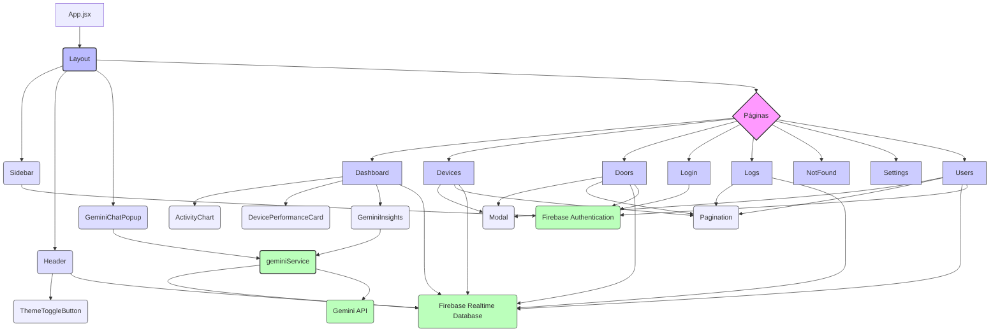

# Documentação do Projeto SecureLab RFID (React)

## 1. Introdução

Este documento fornece uma documentação abrangente do projeto SecureLab RFID, uma aplicação web construída com React para gerenciar o controle de acesso baseado em RFID. O sistema permite monitorar e controlar portas e dispositivos, gerenciar usuários e visualizar logs de acesso, além de fornecer insights gerados por IA.

O objetivo desta documentação é detalhar as ferramentas e tecnologias utilizadas, a estrutura do projeto, a interação com o banco de dados, o funcionamento de cada página e componente chave, as configurações e alguns pontos de melhoria identificados.

## 2. Ferramentas e Tecnologias Utilizadas

O projeto SecureLab React utiliza as seguintes ferramentas e tecnologias:

*   **Linguagem/Framework:** React, JavaScript/JSX
*   **Ferramenta de Build/Desenvolvimento:** Vite
*   **Linting:** ESLint (com `@eslint/js`, `eslint-plugin-react-hooks`, `eslint-plugin-react-refresh`)
*   **Gerenciamento de Dependências:** npm/yarn
*   **Banco de Dados:** Firebase Realtime Database
*   **Autenticação:** Firebase Authentication
*   **Hospedagem/Deploy:** Firebase Hosting
*   **API Externa:** Google Gemini API (integrado via `src/services/geminiService.js`)
*   **Bibliotecas de UI/Componentes:**
    *   @fortawesome/react-fontawesome (Ícones)
    *   recharts, chart.js (Gráficos - `recharts` utilizado no `ActivityChart.jsx`)
*   **Bibliotecas de Utilitários:** date-fns (Manipulação de datas)

## 3. Estrutura do Projeto

A estrutura de diretórios e arquivos do projeto é organizada da seguinte forma:

```
.
??? .firebaserc
??? .gitignore
??? database.rules.json
??? eslint.config.js
??? firebase.json
??? index.html
??? package-lock.json
??? package.json
??? README.md
??? vite.config.js
??? public/
?   ??? vite.svg
??? src/
    ??? App.css
    ??? App.jsx
    ??? index.css
    ??? main.jsx
    ??? assets/
    ?   ??? react.svg
    ??? components/
    ?   ??? ActivityChart.jsx
    ?   ??? DevicePerformanceCard.jsx
    ?   ??? GeminiChatPopup.jsx
    ?   ??? GeminiInsights.jsx
    ?   ??? Header.jsx
    ?   ??? Layout.jsx
    ?   ??? Modal.jsx
    ?   ??? Pagination.jsx
    ?   ??? Sidebar.jsx
    ?   ??? ThemeToggleButton.jsx
    ??? config/
    ?   ??? geminiConfig.js
    ??? context/
    ?   ??? ThemeContext.jsx
    ??? firebase/
    ?   ??? firebaseConfig.js
    ??? pages/
    ?   ??? Dashboard.jsx
    ?   ??? Devices.jsx
    ?   ??? Doors.jsx
    ?   ??? Login.jsx
    ?   ??? Logs.jsx
    ?   ??? NotFound.jsx
    ?   ??? Settings.jsx
    ?   ??? Users.jsx
    ??? services/
    ?   ??? geminiService.js
    ??? styles/
    ?   ??? components.css
    ?   ??? dark-mode.css
    ?   ??? dashboard.css
    ?   ??? devices.css
    ?   ??? gemini-chat-popup.css
    ?   ??? gemini-insights.css
    ?   ??? Login.css
    ?   ??? logs.css
    ?   ??? mobile.css
    ?   ??? styles.css
    ?   ??? utils.css
    ??? utils/
        ??? formatters.js
        ??? helpers.js
        ??? notifications.js
```

*   **`/public`:** Contém arquivos estáticos que são copiados diretamente para o diretório de build (`dist`).
*   **`/src`:** Contém o código fonte da aplicação.
    *   **`/assets`:** Ativos como imagens.
    *   **`/components`:** Componentes React reutilizáveis.
    *   **`/config`:** Arquivos de configuração específicos da aplicação.
    *   **`/context`:** Contextos React para gerenciamento de estado global (ex: tema).
    *   **`/firebase`:** Configuração e inicialização do Firebase.
    *   **`/pages`:** Componentes React que representam as diferentes páginas da aplicação.
    *   **`/services`:** Lógica para interação com APIs externas ou serviços (ex: Gemini).
    *   **`/styles`:** Arquivos CSS para estilização.
    *   **`/utils`:** Funções utilitárias gerais.

## 4. Estrutura do Banco de Dados (Firebase Realtime Database)

A estrutura do banco de dados, inferida a partir de `database.rules.json` e do uso no código, é baseada em nós/coleções para armazenar os dados do sistema:

*   **`users`:** Armazena informações dos usuários.
    *   Campos chave: `name`, `email`, `department`, `role`, `status`, `created_at`, `auth_uid`.
    *   Índices: `email`, `status`, `role`, `department`.
*   **`doors`:** Armazena informações das portas controladas.
    *   Campos chave: `name`, `location`, `status`, `last_status_change`.
    *   Índices: `name`, `status`.
*   **`devices`:** Armazena informações dos dispositivos (leitores RFID, controladores, gateways).
    *   Campos chave: `name`, `typeCode`, `location`, `ip`, `mac`, `firmware`, `status`, `lastActivity`, `needsUpdate`, `cpu_usage`, `ram_usage`, `temperature`, `latency`, `pending_action`, `action_requested_at`, `config`.
    *   Índices: `name`, `status`, `typeCode`, `firmware`.
*   **`access_logs`:** Armazena registros de eventos de acesso e ações em portas.
    *   Campos chave: `user_id`, `user_name`, `door_id`, `door_name`, `action`, `method`, `timestamp`, `reason`.
    *   Índices: `timestamp`, `user_name`, `door_name`, `action`, `method`.

**Observação de Segurança:** As regras de segurança atuais em `database.rules.json` (`".read": true, ".write": true`) permitem acesso público total ao banco de dados. **Isso é altamente inseguro para um ambiente de produção** e deve ser revisado e restrito para permitir acesso apenas a usuários autenticados com as permissões apropriadas.

## 5. Análise Detalhada das Páginas

### Dashboard (`/`)

*   **Funcionalidades:** Apresenta uma visão geral do sistema com cards de status (usuários, portas, dispositivos, acessos hoje), um gráfico de atividade diária, uma lista de atividade recente, o status atual das portas com controle de trancar/destrancar, um card de performance de dispositivos e um painel de insights gerados pelo Gemini.
*   **Interação com Banco de Dados:**
    *   Utiliza listeners em tempo real (`onValue`) nos nós `users`, `doors` e `devices` para manter os cards de status e a lista de status das portas atualizados.
    *   Busca os últimos logs de acesso (`access_logs`) usando `get` para a seção de atividade recente.
    *   Permite atualizar o status de uma porta (`update` no nó `doors`) e registra a ação como um log de acesso (`push` no nó `access_logs`).
*   **Componentes utilizados:** `Layout`, `ActivityChart`, `DevicePerformanceCard`, `GeminiInsights`, `@fortawesome/react-fontawesome`, funções de `formatters.js` e `notifications.js`.

### Devices (`/devices`)

*   **Funcionalidades:** Permite visualizar, buscar, filtrar e paginar uma lista de dispositivos. Inclui modais para adicionar novos dispositivos, editar informações de dispositivos existentes e configurar dispositivos. Permite solicitar ações remotas como reiniciar, restaurar padrões de fábrica e diagnóstico (registrando a intenção no DB). Oferece funcionalidade de exportação da lista (CSV implementado, PDF placeholder).
*   **Interação com Banco de Dados:**
    *   Busca a lista de dispositivos do nó `devices` usando um listener `onValue`.
    *   Adiciona novos dispositivos (`push` no nó `devices`).
    *   Edita dispositivos existentes (`update` no nó `devices`).
    *   Remove dispositivos (`remove` no nó `devices`).
    *   Atualiza o campo `pending_action` no nó do dispositivo para solicitar ações remotas.
*   **Componentes utilizados:** `Layout`, `Modal`, `Pagination`, `@fortawesome/react-fontawesome`, funções de `notifications.js`, `formatters.js` e `helpers.js`.

### Doors (`/doors`)

*   **Funcionalidades:** Permite visualizar, buscar, paginar e gerenciar portas. Inclui modais para adicionar novas portas, editar informações de portas existentes e controlar o status (trancar/destrancar) de uma porta. Permite excluir portas (com modal de confirmação). Oferece funcionalidade de exportação da lista (CSV implementado, PDF placeholder).
*   **Interação com Banco de Dados:**
    *   Busca a lista de portas do nó `doors` usando um listener `onValue`.
    *   Adiciona novas portas (`push` no nó `doors`).
    *   Edita portas existentes (`update` no nó `doors`).
    *   Remove portas (`remove` no nó `doors`).
    *   Atualiza o campo `status` e `last_status_change` no nó da porta (`update`) e registra a ação no nó `access_logs` (`push`).
*   **Componentes utilizados:** `Layout`, `Modal`, `Pagination`, `@fortawesome/react-fontawesome`, funções de `notifications.js`, `formatters.js` e `helpers.js`.

### Login (`/login`)

*   **Funcionalidades:** Página de autenticação para usuários. Permite login com e-mail e senha e oferece a opção de recuperação de senha. Redireciona o usuário para o Dashboard se a autenticação for bem-sucedida ou se ele já estiver logado.
*   **Interação com Firebase Authentication:**
    *   `signInWithEmailAndPassword`: Para autenticar usuários.
    *   `sendPasswordResetEmail`: Para enviar e-mails de recuperação de senha.
    *   `onAuthStateChanged`: Listener para verificar o estado de autenticação do usuário e gerenciar o redirecionamento.
*   **Interação com Banco de Dados:** Nenhuma interação direta com o Realtime Database nesta página.
*   **Componentes utilizados:** `useNavigate` (react-router-dom).

### Logs (`/logs`)

*   **Funcionalidades:** Exibe um histórico detalhado dos registros de acesso e ações no sistema. Permite filtrar os logs por período (pré-definido ou personalizado), tipo de ação, método, usuário e porta. Inclui paginação para navegar pelos resultados. Oferece funcionalidade de exportação da lista filtrada (CSV implementado, PDF placeholder).
*   **Interação com Banco de Dados:**
    *   Busca registros do nó `access_logs` usando `get`. Atualmente, busca os últimos 1000 logs, o que pode ser um ponto de atenção para escalabilidade.
    *   A filtragem por período, ação, método, usuário e porta é realizada no lado do cliente após a busca inicial.
*   **Componentes utilizados:** `Layout`, `Pagination`, `@fortawesome/react-fontawesome`, funções de `notifications.js` e `formatters.js`.

### NotFound (`/404`)

*   **Funcionalidades:** Página exibida quando uma rota não é encontrada. Mostra uma mensagem informativa e um link para retornar ao Dashboard.
*   **Interação com Banco de Dados:** Nenhuma.
*   **Componentes utilizados:** `Link` (react-router-dom).

### Settings (`/settings`)

*   **Funcionalidades:** Página destinada à configuração do sistema, organizada em abas (Sistema, Segurança, Dispositivos, Integração, Notificações, Aparência). Contém formulários para diversas configurações, embora a maioria das seções esteja marcada como `TODO` no código analisado.
*   **Interação com Banco de Dados:** A interação para ler e salvar configurações está planejada (`TODO` no código), mas não implementada na análise atual.
*   **Componentes utilizados:** `Layout`, `@fortawesome/react-fontawesome`.

### Users (`/users`)

*   **Funcionalidades:** Permite visualizar, buscar, filtrar e paginar uma lista de usuários. Inclui um modal para adicionar novos usuários e editar informações de usuários existentes. Permite excluir usuários (com modal de confirmação). Oferece funcionalidade de exportação da lista (CSV implementado, PDF placeholder).
*   **Interação com Firebase Authentication:**
    *   `createUserWithEmailAndPassword`: Utilizado para criar novas contas de usuário no Firebase Auth ao adicionar um usuário.
    *   `updateProfile`: Utilizado para definir o `displayName` do usuário recém-criado no Firebase Auth.
*   **Interação com Banco de Dados:**
    *   Busca a lista de usuários do nó `users` usando um listener `onValue`.
    *   Adiciona novos usuários (`push` e `update` no nó `users`, linkando com o `auth_uid`).
    *   Edita usuários existentes (`update` no nó `users`).
    *   Remove usuários (`remove` no nó `users` - **Nota: A exclusão no Firebase Auth não é feita aqui**).
    *   Verifica a existência de e-mail duplicado no nó `users` antes de adicionar/editar (`query`, `orderByChild`, `equalTo`, `get`).
*   **Componentes utilizados:** `Layout`, `Modal`, `Pagination`, `@fortawesome/react-fontawesome`, funções de `notifications.js`, `formatters.js` e `helpers.js`.

## 6. Análise de Componentes Reutilizáveis

*   **`Layout.jsx`:** Componente de layout principal que define a estrutura da página, incluindo a barra lateral (`Sidebar`), o cabeçalho (`Header`) e a área de conteúdo onde as páginas são renderizadas. Gerencia o estado de colapsamento da sidebar e do menu mobile.
*   **`Modal.jsx`:** Componente genérico para exibir conteúdo em um pop-up modal. Controla a visibilidade, exibe título e rodapé opcionais, suporta diferentes tamanhos e permite fechamento por clique externo, botão ou tecla Escape.
*   **`Pagination.jsx`:** Componente para exibir controles de paginação para listas de dados. Exibe informações sobre os itens visíveis, botões de navegação (anterior/próximo) e números de página.
*   **`Sidebar.jsx`:** Componente que renderiza a barra de navegação lateral. Contém links para as diferentes rotas da aplicação e implementa a funcionalidade de logout utilizando o Firebase Authentication.
*   **`Header.jsx`:** Componente que renderiza o cabeçalho superior. Exibe o nome do usuário logado (buscado no DB), um contador de alertas (baseado em dispositivos offline do DB), um botão para alternar o tema e um toggle para o menu mobile.
*   **`ActivityChart.jsx`:** Componente utilizado no Dashboard para exibir um gráfico de barras da atividade de acesso por porta ao longo do tempo, utilizando a biblioteca `recharts`. Busca logs do DB, processa e filtra os dados localmente e permite seleção de portas e intervalo de datas.
*   **`DevicePerformanceCard.jsx`:** Componente utilizado no Dashboard para exibir um resumo do status dos dispositivos e as métricas de performance do dispositivo mais sobrecarregado (CPU, RAM, Temperatura, Latência), buscando dados do nó `devices` no DB.
*   **`GeminiChatPopup.jsx`:** Componente que implementa um pop-up de chat flutuante para interagir com o assistente Gemini, utilizando funções do `geminiService.js`. Gerencia o estado do chat, histórico local e formatação básica de respostas.
*   **`GeminiInsights.jsx`:** Componente utilizado no Dashboard para exibir insights gerados pelo modelo Gemini, utilizando funções do `geminiService.js`. Exibe um resumo e uma lista de insights, com opções de atualização manual e automática.
*   **`ThemeToggleButton.jsx`:** Componente de botão simples utilizado no `Header` para alternar entre o tema claro e escuro da aplicação, utilizando o `ThemeContext`.

## 7. Diagrama da Estrutura de Componentes



## 8. Análise de Serviços e Utilitários

*   **`src/services/geminiService.js`:** Este serviço é responsável pela integração com a API do Google Gemini. Ele busca dados limitados do Firebase Realtime Database para fornecer contexto ao modelo, constrói o prompt do sistema dinamicamente e gerencia a comunicação com a API Gemini para funcionalidades de chat e geração de insights. Implementa um cache simples para os dados do sistema e gerencia o histórico da conversa de chat localmente.
*   **`src/firebase/firebaseConfig.js`:** Inicializa a aplicação Firebase utilizando as configurações carregadas de variáveis de ambiente (`import.meta.env`). Exporta as instâncias configuradas de Firebase Authentication (`auth`) e Firebase Realtime Database (`database`) para serem utilizadas em outras partes da aplicação.
*   **`src/utils/formatters.js`:** Contém funções utilitárias para formatar dados para exibição na interface do usuário, como formatação de datas e horas, mapeamento de status para classes CSS e tradução de strings de status e papéis para texto legível em português.
*   **`src/utils/notifications.js`:** Implementa a lógica para exibir notificações pop-up no canto superior direito da tela. Cria e gerencia elementos DOM para as notificações, suporta diferentes tipos (info, success, error, warning) com ícones e cores correspondentes, e lida com o fechamento automático ou manual.
*   **`src/utils/helpers.js`:** Contém funções utilitárias gerais, como a função `debounce`, utilizada para limitar a frequência de execução de funções em resposta a eventos rápidos (ex: digitação).

## 9. Configurações

*   **`.firebaserc`:** Arquivo de configuração do Firebase CLI que especifica o projeto padrão do Firebase (`rfid-com-esp32`) associado a este diretório local.
*   **`firebase.json`:** Configurações para o deploy e hospedagem do projeto no Firebase. Define o diretório público (`dist`), arquivos a serem ignorados e regras de rewrite para suportar o roteamento de Single Page Application (SPA). Também aponta para o arquivo de regras de segurança do Realtime Database (`database.rules.json`).
*   **`vite.config.js`:** Arquivo de configuração para a ferramenta de build Vite. Configura o plugin `@vitejs/plugin-react` para suportar o desenvolvimento com React.
*   **`eslint.config.js`:** Arquivo de configuração para o ESLint, utilizado para análise estática de código. Define regras, plugins (incluindo para React Hooks e Fast Refresh) e arquivos a serem ignorados para manter a qualidade e consistência do código.
*   **`src/config/geminiConfig.js`:** (Inferido pelo uso) Este arquivo provavelmente contém as configurações específicas para a integração com a API do Gemini, como a chave de API, o endpoint, limites de dados para contexto, configurações de temperatura e segurança para a geração de texto, e configurações específicas para as funcionalidades de chat e insights (ex: habilitar/desabilitar, intervalo de atualização).

## 10. Considerações e Pontos de Melhoria

Durante a análise do projeto, alguns pontos foram identificados que podem ser considerados para melhorias futuras:

*   **Segurança do Banco de Dados:** As regras de segurança atuais do Firebase Realtime Database (`.read: true, .write: true`) são inadequadas para produção. É crucial implementar regras mais restritivas baseadas na autenticação e autorização dos usuários.
*   **Escalabilidade da Busca de Dados:** A estratégia de buscar todos os logs de acesso ou dados limitados para o contexto Gemini usando `get` pode se tornar ineficiente com o crescimento do volume de dados. Considerar paginação baseada em cursor ou consultas mais otimizadas no lado do servidor pode ser necessário.
*   **Gerenciamento Completo de Usuários:** A exclusão de usuários atualmente remove o registro apenas do Realtime Database, não do Firebase Authentication. Para um gerenciamento completo, a exclusão também deve ocorrer no Firebase Auth (geralmente requer lógica de backend ou Admin SDK). A atualização de e-mail no Firebase Auth também é uma operação que requer cuidado e pode precisar ser implementada.
*   **Refatoração de Utilitários:** Funções utilitárias duplicadas (`escapeHtml`, `formatResponse`) poderiam ser movidas para um arquivo compartilhado em `src/utils/` para evitar repetição de código.
*   **Implementação de Placeholders:** Funcionalidades marcadas como `TODO` no código (ex: exportação PDF, seções de configuração em Settings) precisam ser implementadas para completar as funcionalidades planejadas.
*   **Gerenciamento de Estado do Gemini Assistant:** A forma como o toggle do Gemini Assistant é exposto globalmente (`window.geminiAssistant`) funciona, mas usar React Context ou uma biblioteca de gerenciamento de estado (como Zustand ou Redux) pode ser uma abordagem mais robusta e "React-idiomática" para comunicação entre componentes não diretamente relacionados.