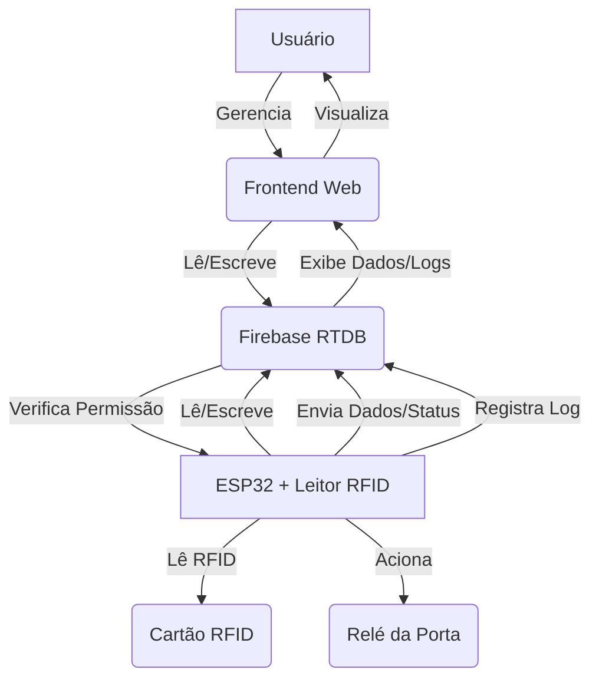

# Plano de Integração ESP32, RFID e Firebase

Este documento descreve o plano para integrar um dispositivo ESP32 com leitor RFID ao sistema SecureLab, utilizando o Firebase Realtime Database para gerenciamento de usuários, portas, logs e status dos dispositivos.

## Objetivo

Conectar um ESP32 ao Firebase para permitir a abertura de portas via cartão RFID, registrar logs de acesso associados a usuários e monitorar o status e benchmark do dispositivo.

## Análise da Estrutura Atual do Firebase RTDB

A estrutura atual do Firebase RTDB inclui os nós `access_logs`, `devices`, `doors` e `users`. O nó `users` já possui um campo `rfidTagId` em alguns registros, indicando que a associação de RFID a usuários já foi considerada. O nó `devices` já contém campos para dados de benchmark (`cpu_usage`, `ram_usage`, `temperature`, `uptime`, `last_online`, `status`). O nó `access_logs` registra informações de acesso com `user_id` e `user_name`.

## Plano de Adaptação do Firebase RTDB e Frontend

Com base na estrutura existente, as seguintes adaptações serão realizadas:

1.  **Estrutura do RTDB:**
    *   Manter a estrutura existente para `users`, `doors`, `devices`, e `access_logs`.
    *   No nó `users`, formalizar o uso do campo `rfidTagId` para armazenar o UID do cartão RFID associado a cada usuário. Garantir que este campo seja indexado nas regras de segurança (`database.rules.json`) para permitir buscas eficientes por UID.
    *   No nó `devices`, garantir que os campos `cpu_usage`, `ram_usage`, `temperature`, `uptime`, `last_online`, e `status` (para online/offline) sejam usados pelo ESP32 para enviar dados de benchmark e status.
    *   No nó `access_logs`, garantir que os logs gerados pelo ESP32 via RFID incluam `user_id`, `user_name`, `door_id`, `door_name`, `action` (e.g., `access_granted_rfid`, `access_denied_rfid`), `method` (`rfid`), e `timestamp`.

2.  **Adaptações no Frontend:**
    *   **Página de Usuários (`src/pages/Users.jsx`):**
        *   Adicionar um campo ou seção na interface de edição/criação de usuário para associar um `rfidTagId` ao usuário. A entrada manual do UID do RFID será a abordagem inicial.
        *   Atualizar a lógica de salvamento de usuário para incluir o `rfidTagId` no Firebase.
    *   **Página de Logs (`src/pages/Logs.jsx`):**
        *   Garantir que a exibição dos logs de acesso funcione corretamente para entradas com `method: 'rfid'`, mostrando o nome do usuário associado ao `rfidTagId`.

## Plano de Implementação (Alto Nível)

Este plano detalha os passos para a implementação das adaptações no RTDB e frontend:

*   [x] **Passo 1: Modificar a estrutura do RTDB (se necessário) e regras de segurança.**
    *   Verificar `database.rules.json` e adicionar um índice para o campo `rfidTagId` no nó `users` se ainda não existir.
*   [x] **Passo 2: Implementar a funcionalidade de associação de RFID a usuário no frontend.**
    *   Modificar o componente ou página responsável pela edição/criação de usuários (`src/pages/Users.jsx`) para incluir um campo de input para o `rfidTagId`.
    *   Atualizar a função que salva os dados do usuário no Firebase para incluir o valor do campo `rfidTagId`.
*   [x] **Passo 3: Revisar a exibição de logs no frontend.**
    *   Verificar o código em `src/pages/Logs.jsx` para garantir que ele lide corretamente com logs onde o `method` é `rfid` e exiba as informações relevantes (usuário, porta, timestamp, ação).
*   [ ] **Passo 4: (Próxima Fase) Desenvolver o código para o ESP32.**
    *   Configurar o ambiente de desenvolvimento do ESP32.
    *   Implementar a leitura do UID do cartão RFID.
    *   Desenvolver a lógica de comunicação com o Firebase para:
        *   Consultar o nó `users` para encontrar um usuário com o `rfidTagId` lido.
        *   Verificar permissões de acesso (se aplicável, embora o plano inicial foque apenas em identificar o usuário).
        *   Registrar um novo log no nó `access_logs` com as informações relevantes.
        *   Enviar dados de benchmark periodicamente para o nó `devices`.
        *   Implementar a funcionalidade de presença para atualizar o status online/offline no nó `devices`.
    *   Implementar o controle do relé da porta com base na permissão de acesso.

## Diagrama Conceitual

Este plano detalha as etapas necessárias para adaptar o Firebase RTDB e o frontend para a integração com o ESP32 e RFID. Uma vez que estas adaptações estejam completas, a próxima fase será o desenvolvimento do código para o ESP32.